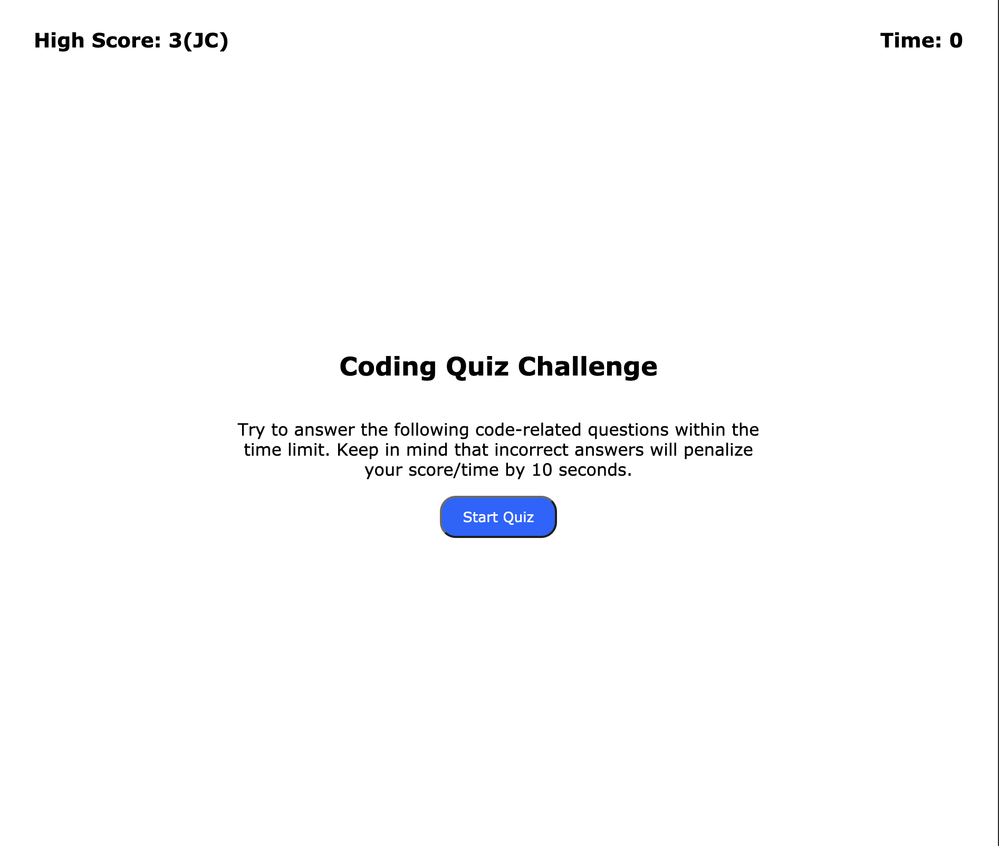

# Coding Quiz

This page contains a timed quiz. The timer starts at 75 seconds and will decrease by 10 seconds for every wrong answer. The quiz is over when all the questions have been answered or the timer reaches 0 seconds. The user can then enter their name or initials. Only the highest score is recorded to local storage and displayed on the top left corner.

[Test your knowledge!](https://jochsf.github.io/coding-quiz/)